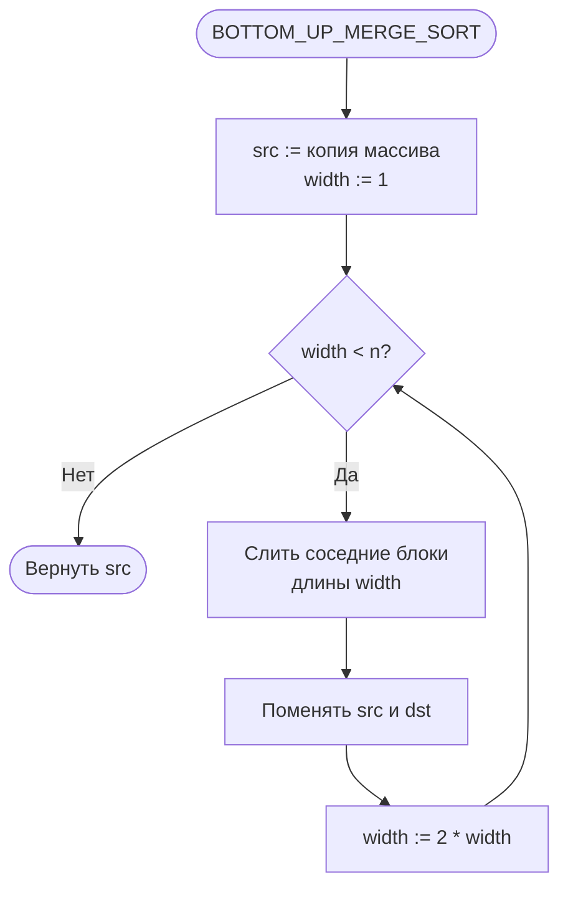

```mermaid
flowchart TD
    A(["BOTTOM_UP_MERGE_SORT"]) --> B["src := копия массива<br/>width := 1"]
    B --> C{"width < n?"}
    C -- Нет --> Z([Вернуть src])
    C -- Да --> D["Слить соседние блоки<br/>длины width"]
    D --> E["Поменять src и dst"]
    E --> F["width := 2 * width"] --> C
```