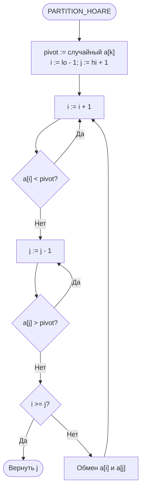

```mermaid
flowchart TD
    A(["PARTITION_HOARE"]) --> B["pivot := случайный a[k]<br/>i := lo - 1; j := hi + 1"]
    B --> C["i := i + 1"]
    C --> D{"a[i] < pivot?"}
    D -- Да --> C
    D -- Нет --> E["j := j - 1"]
    E --> F{"a[j] > pivot?"}
    F -- Да --> E
    F -- Нет --> G{"i >= j?"}
    G -- Да --> H([Вернуть j])
    G -- Нет --> I["Обмен a[i] и a[j]"] --> C
```