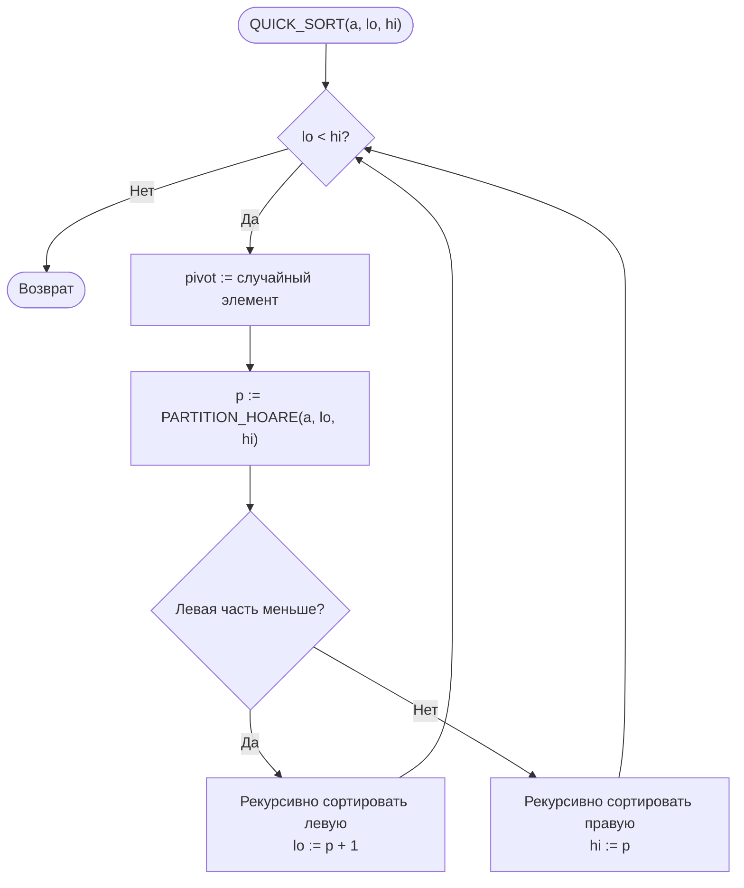

```mermaid
flowchart TD
    A(["QUICK_SORT(a, lo, hi)"]) --> B{"lo < hi?"}
    B -- Нет --> Z([Возврат])
    B -- Да --> C["pivot := случайный элемент"]
    C --> D["p := PARTITION_HOARE(a, lo, hi)"]
    D --> E{"Левая часть меньше?"}
    E -- Да --> F["Рекурсивно сортировать левую<br/>lo := p + 1"]
    E -- Нет --> G["Рекурсивно сортировать правую<br/>hi := p"]
    F --> B
    G --> B
```